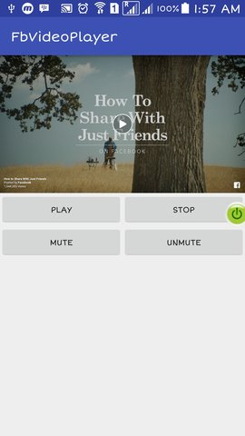

Facebook Embedded Videos Android Player
=======================================
An Android WebView Helper to plays videos from Facebook embedded

Resources : 
[https://developers.facebook.com/docs/plugins/embedded-video-player/api](https://developers.facebook.com/docs/plugins/embedded-video-player/api)

Screenshot
========



How to use
----------
Gradle:

```gradle
 repositories {
  jcenter()
  maven {
    url 'https://dl.bintray.com/zeattacker/maven/'
  }
}

dependencies {
  compile 'com.ramazeta:fb-android-videoplayer:0.0.2'
}
```

Maven:

```xml
<dependency>
  <groupId>com.ramazeta</groupId>
  <artifactId>fb-android-videoplayer</artifactId>
  <version>0.0.2</version>
  <type>pom</type>
</dependency>
```


How to use FB Video Player
--------------------------
Detail of usage : [MainActivity.java][1].

Example :
* XML

```xml
    <com.ramazeta.fbvideoplayer.FacebookPlayer
        android:id="@+id/fbPlayerView"
        android:layout_width="match_parent"
        android:layout_height="wrap_content" />

```

* JAVA

```java
        // get id from XML
        FacebookPlayer fbPlayerView = (FacebookPlayer) findViewById(R.id.fbPlayerView);

       // auto heights
        fbPlayerView.setAutoPlayerHeight(this);
        // init with app_id and video_url
        fbPlayerView.initialize("app_fb_id", "video_url");
        
        //play video
        fbPlayerView.play();
        
        //pause video
        fbPlayerView.pause();
        
        //mute video
        fbPlayerView.mute();
        
        //unmute video
        fbPlayerView.unmute();
        

```


Updated
------
v 0.0.1 - Uploaded


Author
------
Rama Zeta - @zeattacker on GitHub, ramazeta1997@gmail.com


Disclaimer
---------
This is not an official Facebook Products.

License
-------
```code
Copyright 2016 Rama Zeta

Licensed under the Apache License, Version 2.0 (the "License");
you may not use this file except in compliance with the License.
You may obtain a copy of the License at

http://www.apache.org/licenses/LICENSE-2.0

Unless required by applicable law or agreed to in writing, software
distributed under the License is distributed on an "AS IS" BASIS,
WITHOUT WARRANTIES OR CONDITIONS OF ANY KIND, either express or implied.
See the License for the specific language governing permissions and
limitations under the License.
```

